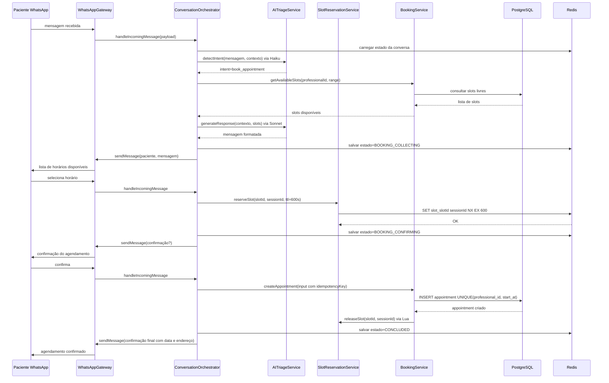
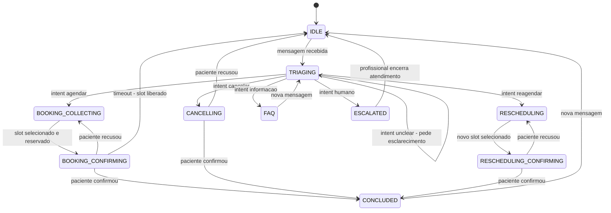
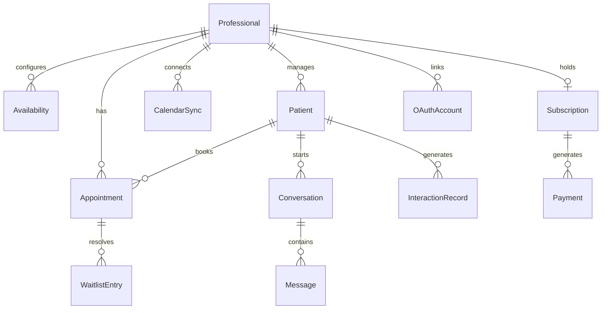

# Design Técnico — Próxima Consulta

## Visão Geral

O **Próxima Consulta** é um SaaS greenfield que automatiza a gestão de agenda e o atendimento de pacientes via WhatsApp com IA Generativa. O profissional de saúde configura sua disponibilidade e o sistema assume integralmente o atendimento inicial, agendamento, confirmação, lembretes e faturamento — eliminando a necessidade de secretária.

A arquitetura adota um **Monólito Modular** (NestJS) com limites de domínio explícitos, separando o backend do frontend (Next.js). Todos os serviços externos (WhatsApp, IA, Calendário, Pagamento) são isolados em adaptadores de porta, tornando o domínio testável e independente de vendor.

**Usuários**: Profissionais de saúde autônomos (dentistas, fisioterapeutas) via Painel Web; pacientes via WhatsApp.
**Impacto**: Plataforma nova — sem sistema legado a migrar.

### Objetivos
- Automatizar o ciclo completo de agendamento via WhatsApp com IA (triagem → agendamento → lembrete → confirmação)
- Fornecer um painel web com visualização e controle em tempo real da agenda
- Suportar sincronização bidirecional com Google Calendar e Outlook
- Gerenciar assinaturas com cobrança recorrente via PIX, cartão e boleto
- Garantir conformidade com LGPD para dados pessoais de pacientes

### Não-Objetivos
- Prontuário eletrônico completo (apenas histórico de agendamentos e notas simples)
- Aplicativo mobile nativo (painel web responsivo cobre este caso)
- Multi-idioma (somente português brasileiro)
- Suporte a múltiplos profissionais por conta (multi-tenant por conta é futuro)
- Emissão de nota fiscal (depende de gateway a ser definido)

---

## Mapeamento de Requisitos

| Requisito | Resumo | Componentes | Interfaces | Fluxos |
|-----------|--------|-------------|------------|--------|
| 1.1–1.6 | Configuração de disponibilidade | AvailabilityService, SlotCalculationService | AvailabilityService API | — |
| 2.1–2.6 | Sincronização de calendário | CalendarSyncService, CalendarGateway | CalendarSyncService API, CalendarGateway port | Sincronização bidirecional |
| 3.1–3.5 | Dashboard de agenda | DashboardController, SSE EventBus | REST GET /dashboard, SSE /events | Real-time SSE |
| 4.1–4.5 | Triagem inteligente WhatsApp | ConversationOrchestrator, AITriageService, WhatsAppGateway | WhatsApp Webhook POST | Fluxo WhatsApp |
| 5.1–5.10 | Agendamento self-service | BookingService, SlotReservationService, ConversationOrchestrator | BookingService API | Fluxo de Reserva |
| 6.1–6.5 | Lembretes automáticos | ReminderJob, NotificationService | BullMQ Job Contract | — |
| 7.1–7.4 | Cadastro automático de pacientes | PatientService | PatientService API | — |
| 8.1–8.5 | Histórico de atendimento | PatientService, InteractionRecordService | PatientService API | — |
| 9.1–9.6 | Lista de espera inteligente | WaitlistService, NotificationService | WaitlistService API | — |
| 10.1–10.5 | Social Login Google | OAuthService, AuthService | OAuth callback GET, AuthService API | — |
| 11.1–11.5 | Login e-mail/senha + 2FA | AuthService, TwoFactorService | Auth REST API | — |
| 12.1–12.4 | Vínculo de contas | AccountLinkingService | Account Link API | — |
| 13.1–13.7 | Checkout e pagamento | PaymentService, SubscriptionService, PaymentGateway | Checkout API, Asaas Webhook | — |
| 14.1–14.3 | Painel de faturamento | BillingDashboardService | Billing REST API | — |
| 15.1–15.5 | Free Trial | SubscriptionService, TrialExpirationJob | SubscriptionService API | — |

---

## Arquitetura

### Padrão Arquitetural e Mapa de Limites

**Padrão selecionado**: Monólito Modular com Hexagonal/Ports-and-Adapters nas integrações externas.
- Seis módulos de domínio com limites explícitos: Schedule, Conversation, Booking, Patient, Auth, Billing.
- Adaptadores externos (WhatsApp, IA, Calendário, Pagamento) implementam interfaces de porta definidas no domínio.
- Comunicação entre módulos via chamada direta de serviço (sem messaging distribuído no MVP). Domínios não acessam o banco de outros diretamente.

```mermaid
graph TB
    subgraph Client
        WebApp[Next.js 14 Web App]
    end

    subgraph Backend[Backend NestJS Modular Monolith]
        subgraph ScheduleMod[Schedule]
            AvailSvc[AvailabilityService]
            CalSync[CalendarSyncService]
            SlotCalc[SlotCalculationService]
        end
        subgraph ConvMod[Conversation]
            WHHandler[WhatsAppWebhookHandler]
            ConvOrch[ConversationOrchestrator]
            AITriage[AITriageService]
        end
        subgraph BookingMod[Booking]
            BookingSvc[BookingService]
            SlotRes[SlotReservationService]
            Waitlist[WaitlistService]
            ReminderJob[ReminderJob]
        end
        subgraph PatientMod[Patient]
            PatientSvc[PatientService]
        end
        subgraph AuthMod[Auth]
            AuthSvc[AuthService]
            OAuthSvc[OAuthService]
            TwoFASvc[TwoFactorService]
        end
        subgraph BillingMod[Billing]
            SubSvc[SubscriptionService]
            PaySvc[PaymentService]
            TrialJob[TrialExpirationJob]
        end
        subgraph Infra[Infrastructure Adapters]
            WHGateway[WhatsAppGateway]
            AIGateway[AIGateway]
            CalGateway[CalendarGateway]
            PayGateway[PaymentGateway]
            AuditLog[AuditLogService]
            EventBus[SSE EventBus]
        end
    end

    subgraph Storage
        PG[(PostgreSQL)]
        Redis[(Redis)]
    end

    subgraph External
        WA[WhatsApp Cloud API]
        Claude[Anthropic Claude API]
        GCal[Google Calendar API]
        MSGraph[Microsoft Graph API]
        Asaas[Asaas Payments API]
        GoogleOAuth[Google OAuth2]
        EmailSvc[Email - Resend]
    end

    WebApp -->|REST plus SSE| Backend
    WA -->|webhook POST| WHHandler
    WHGateway --> WA
    AIGateway --> Claude
    CalGateway --> GCal
    CalGateway --> MSGraph
    PayGateway --> Asaas
    OAuthSvc --> GoogleOAuth
    Infra --> EmailSvc
    Backend --> PG
    SlotRes --> Redis
    ConvOrch --> Redis
    ReminderJob --> Redis
    TrialJob --> Redis
    EventBus -->|SSE push| WebApp
```



### Stack Tecnológico

| Camada | Escolha / Versão | Papel | Notas |
|--------|-----------------|-------|-------|
| Frontend | Next.js 14 (App Router) + TypeScript | Dashboard web SSR + Client Components interativos | SSE via Route Handlers |
| Backend API | NestJS 10 + TypeScript | API REST, webhooks, jobs, lógica de domínio | Módulos por domínio |
| ORM | Prisma 5 | Acesso ao banco com type-safety | Migrations versionadas |
| Banco de dados | PostgreSQL 16 | Persistência principal | Constraints de unicidade como backstop |
| Cache / Lock / Queue | Redis 7 + BullMQ | Reserva de slots, estado de conversação, jobs agendados | SET NX EX para locks |
| WhatsApp | Meta WhatsApp Cloud API | Canal de mensagens com pacientes | Templates pré-aprovados para proativas |
| LLM (roteamento) | Claude Haiku 4.5 | Detecção de intenção (~0,5s por chamada) | Baixo custo por chamada |
| LLM (orquestração) | Claude Sonnet 4.6 | Tool calling, geração de resposta | Contexto 200k tokens |
| Pagamento | Asaas | PIX recorrente, boleto, cartão, assinaturas | Único com PIX recorrente nativo no Brasil |
| Calendário | Google Calendar API v3 + Microsoft Graph v1.0 | Sincronização bidirecional | Webhook push para eventos |
| Auth | JWT (Access 15min + Refresh 7d) + TOTP (2FA) | Autenticação de profissionais | bcrypt custo 12 para senhas |
| Email | Resend | E-mails transacionais (verificação, reset, alertas) | |
| Infraestrutura | Node.js 20 LTS | Runtime | Deploy via Docker + Railway/Render |

---

## Fluxos do Sistema

### Fluxo de Mensagem WhatsApp (Triagem + Agendamento)



**Decisões-chave**: O LLM nunca decide se o slot está disponível — apenas coleta a seleção do paciente. A disponibilidade real é verificada pelo BookingService no banco. O lock Redis previne double-booking entre requisições concorrentes; o constraint UNIQUE no banco é o backstop final.

---

### Máquina de Estados da Conversa



---

## Componentes e Interfaces

### Tipos Compartilhados

```typescript
type Result<T, E = DomainError> =
  | { ok: true; value: T }
  | { ok: false; error: E };

type DomainError =
  | { code: 'SLOT_NOT_AVAILABLE'; slotId: string }
  | { code: 'SLOT_RESERVATION_EXPIRED'; slotId: string }
  | { code: 'APPOINTMENT_IN_PAST' }
  | { code: 'BELOW_MIN_ADVANCE_NOTICE'; minHours: number }
  | { code: 'APPOINTMENT_NOT_FOUND'; id: string }
  | { code: 'APPOINTMENT_ALREADY_PAST'; id: string }
  | { code: 'PATIENT_NOT_FOUND'; id: string }
  | { code: 'CONFLICT'; resource: string }
  | { code: 'SUBSCRIPTION_REQUIRED' }
  | { code: 'TRIAL_ALREADY_USED' }
  | { code: 'OAUTH_ACCOUNT_ALREADY_LINKED'; provider: string }
  | { code: 'VALIDATION_ERROR'; fields: Record<string, string> }
  | { code: 'EXTERNAL_SERVICE_UNAVAILABLE'; service: string }
  | { code: 'UNAUTHORIZED' }
  | { code: 'RATE_LIMITED'; retryAfterSeconds: number };
```

---

### Domínio: Schedule

| Componente | Camada | Intent | Req | Dependências P0/P1 | Contratos |
|-----------|--------|--------|-----|--------------------|-----------|
| AvailabilityService | Domain | Gerencia templates semanais de disponibilidade | 1.1–1.6 | PostgreSQL (P0) | Service, API |
| SlotCalculationService | Domain | Calcula slots livres subtraindo agendamentos existentes | 1.3, 5.1 | AvailabilityService (P0), BookingService (P0) | Service |
| CalendarSyncService | Domain | Sincronização bidirecional com Google Calendar e Outlook | 2.1–2.6 | CalendarGateway (P0), BookingService (P0) | Service, Event |
| DashboardController | API | Agrega dados de agenda para o painel web | 3.1–3.5 | SlotCalculationService (P0), SSE EventBus (P1) | API |

#### AvailabilityService

| Campo | Detalhe |
|-------|---------|
| Intent | Persistir e recuperar configuração de disponibilidade semanal do profissional |
| Requirements | 1.1, 1.2, 1.3, 1.4, 1.5, 1.6 |

**Responsabilidades e Restrições**
- Proprietário dos dados de `availability` (template semanal por dia da semana).
- Ao salvar, publica evento `AvailabilityUpdated` para que o `ConversationOrchestrator` invalide cache de slots.
- AC 1.6: se uma configuração nova for salva enquanto há fluxo de agendamento ativo, o slot já oferecido deve ser preservado até o TTL da reserva expirar.

**Contratos**: Service [x] / API [x] / Event [x]

##### Service Interface
```typescript
interface AvailabilityConfig {
  dayOfWeek: 0 | 1 | 2 | 3 | 4 | 5 | 6;
  startTime: string;       // HH:mm
  endTime: string;         // HH:mm
  slotDurationMinutes: number;
  breakDurationMinutes: number;
  isActive: boolean;
}

interface IAvailabilityService {
  getConfig(professionalId: string): Promise<Result<AvailabilityConfig[]>>;
  updateConfig(professionalId: string, config: AvailabilityConfig[]): Promise<Result<void>>;
  getAvailableSlots(professionalId: string, from: Date, to: Date): Promise<Result<TimeSlot[]>>;
}

interface TimeSlot {
  slotId: string;   // formato: "{professionalId}:{ISO-date}:{HHmm}"
  startAt: Date;
  endAt: Date;
  isReserved: boolean;
}
```
- Pré-condição: `endTime > startTime`; `slotDurationMinutes >= 15`
- Pós-condição: slots recalculados e propagados ao ConversationOrchestrator via evento
- Invariante: um profissional não pode ter dois `AvailabilityConfig` para o mesmo `dayOfWeek`

##### Event Contract
- Publicado: `AvailabilityUpdated { professionalId, updatedAt }`
- Subscrito: nenhum
- Garantia: at-least-once via BullMQ

---

#### CalendarSyncService

| Campo | Detalhe |
|-------|---------|
| Intent | Sincronizar eventos externos para bloquear slots e exportar agendamentos criados no sistema |
| Requirements | 2.1, 2.2, 2.3, 2.4, 2.5, 2.6 |

**Responsabilidades e Restrições**
- AC 2.6: se um evento externo chegar para um slot em processo de agendamento, o lock Redis garante que apenas uma operação seja efetivada (via constraint UNIQUE no banco como backstop).
- Operações de sync são idempotentes: reprocessar o mesmo webhook não cria eventos duplicados.

**Dependências**
- Outbound: CalendarGateway — listagem e criação de eventos (P0)
- Outbound: BookingService — bloquear/desbloquear slots (P0)
- External: Google Calendar API v3, Microsoft Graph v1.0 (P0)

**Contratos**: Service [x] / Event [x]

##### Service Interface
```typescript
interface ICalendarSyncService {
  connectCalendar(professionalId: string, provider: 'google' | 'outlook', authCode: string): Promise<Result<void>>;
  disconnectCalendar(professionalId: string, provider: 'google' | 'outlook'): Promise<Result<void>>;
  syncExternalEvents(professionalId: string): Promise<Result<{ blocked: number; released: number }>>;
  handleExternalWebhook(provider: 'google' | 'outlook', payload: unknown): Promise<void>;
  exportAppointmentToCalendar(appointmentId: string): Promise<Result<{ eventId: string }>>;
}
```

##### Event Contract
- Subscrito: `AppointmentCreated`, `AppointmentCancelled` → exporta/remove evento externo
- Publicado: `CalendarSyncFailed { professionalId, provider, error }` → notifica profissional

---

### Domínio: Conversation

| Componente | Camada | Intent | Req | Dependências P0/P1 | Contratos |
|-----------|--------|--------|-----|--------------------|-----------|
| WhatsAppWebhookHandler | Infra/API | Recebe e valida payloads do WhatsApp Cloud API | 4.1, 4.4 | WhatsAppGateway (P0) | API |
| ConversationOrchestrator | Domain | Gerencia state machine de conversação | 4.1–4.5, 5.1–5.10 | Redis (P0), AITriageService (P0), BookingService (P0) | Service, State |
| AITriageService | Domain | Detecção de intenção e geração de resposta via LLM | 4.1, 4.2, 4.3, 4.5 | AIGateway (P0) | Service |

#### ConversationOrchestrator

| Campo | Detalhe |
|-------|---------|
| Intent | Controlar o ciclo de vida da conversa WhatsApp via state machine determinística |
| Requirements | 4.1, 4.2, 4.3, 4.4, 4.5, 5.1, 5.2, 5.3, 5.7, 5.8, 5.9, 5.10 |

**Responsabilidades e Restrições**
- Toda transição de estado é determinística e controlada pelo Orchestrator; o LLM apenas coleta dados e gera texto.
- Estado da conversa persistido no Redis com TTL de 30 minutos de inatividade (AC 5.9).
- AC 5.7: valida que o slot solicitado não está no passado antes de chamar SlotReservationService.
- AC 5.8: consulta BookingService para verificar se o cancelamento é de consulta futura.

**Contratos**: Service [x] / State [x]

##### Service Interface
```typescript
type ConversationState =
  | 'IDLE' | 'TRIAGING' | 'BOOKING_COLLECTING' | 'BOOKING_CONFIRMING'
  | 'CANCELLING' | 'RESCHEDULING' | 'RESCHEDULING_CONFIRMING'
  | 'FAQ' | 'ESCALATED' | 'CONCLUDED';

type Intent =
  | 'book_appointment' | 'cancel_appointment' | 'reschedule_appointment'
  | 'general_info' | 'human_handoff' | 'unclear';

interface ConversationContext {
  conversationId: string;
  patientId: string;
  professionalId: string;
  state: ConversationState;
  collectedData: Partial<{ serviceType: string; selectedSlotId: string; targetAppointmentId: string }>;
  pendingSlotId: string | null;
  expiresAt: Date;
}

interface IConversationOrchestrator {
  handleIncomingMessage(payload: WhatsAppInboundPayload): Promise<void>;
  escalateToHuman(conversationId: string): Promise<Result<void>>;
  resolveEscalation(conversationId: string, professionalId: string): Promise<Result<void>>;
}
```

##### State Management
- Estado armazenado no Redis: `HSET conv:{patientPhone}:{professionalId} ...fields`
- TTL: `EXPIRE conv:* 1800` (30 minutos de inatividade)
- Concorrência: mensagens do mesmo paciente processadas sequencialmente via lock por chave de conversa

---

#### AITriageService

| Campo | Detalhe |
|-------|---------|
| Intent | Detectar intenção com Claude Haiku e gerar respostas com Claude Sonnet via tool calling |
| Requirements | 4.1, 4.2, 4.3, 4.5 |

**Contratos**: Service [x]

##### Service Interface
```typescript
interface AITool {
  name: string;
  description: string;
  inputSchema: Record<string, unknown>;
}

interface AIToolResult {
  toolName: string;
  output: unknown;
}

interface IAITriageService {
  detectIntent(
    message: string,
    context: ConversationContext
  ): Promise<Result<{ intent: Intent; confidence: number }>>;

  generateResponse(
    context: ConversationContext,
    data: unknown
  ): Promise<Result<string>>;

  executeWithTools(
    context: ConversationContext,
    tools: AITool[],
    toolExecutor: (name: string, input: unknown) => Promise<unknown>
  ): Promise<Result<string>>;
}
```

**Notas de Implementação**
- `detectIntent` usa Claude Haiku (baixa latência, baixo custo).
- `executeWithTools` usa Claude Sonnet 4.6 para fluxos com tool calling.
- Prompts incluem o estado da conversa como JSON estruturado — nunca o histórico completo de mensagens.
- Risco: latência acima de 5s em picos → mitigação: enviar typing indicator imediatamente e processar de forma assíncrona.

---

### Domínio: Booking

| Componente | Camada | Intent | Req | Dependências P0/P1 | Contratos |
|-----------|--------|--------|-----|--------------------|-----------|
| BookingService | Domain | CRUD de agendamentos com validação de regras de negócio | 5.1–5.10, 3.1–3.5 | PostgreSQL (P0), SlotReservationService (P0), SSE EventBus (P1) | Service, API, Event |
| SlotReservationService | Domain | Lock distribuído de slots via Redis para evitar double-booking | 5.1, 5.5 | Redis (P0) | Service |
| WaitlistService | Domain | Gerência de lista de espera com notificação FIFO | 9.1–9.6 | PatientService (P0), NotificationService (P0) | Service |
| ReminderJob | Infra/Job | Job BullMQ que envia lembretes de consulta 24h antes | 6.1–6.5 | NotificationService (P0), PostgreSQL (P0) | Batch |

#### BookingService

| Campo | Detalhe |
|-------|---------|
| Intent | Criar, cancelar e reagendar consultas com validação de regras e prevenção de conflitos |
| Requirements | 3.1, 3.2, 3.3, 3.4, 3.5, 5.1, 5.2, 5.3, 5.4, 5.5, 5.6, 5.7, 5.8, 5.9, 5.10 |

**Responsabilidades e Restrições**
- AC 5.7: rejeita criação se `startAt < now()`.
- AC 5.8: rejeita cancelamento se `startAt < now()`.
- AC 5.10: verifica antecedência mínima configurável antes de criar ou cancelar.
- Ao criar/cancelar, publica evento para CalendarSyncService e SSE EventBus.

**Contratos**: Service [x] / API [x] / Event [x]

##### Service Interface
```typescript
interface Appointment {
  id: string;
  professionalId: string;
  patientId: string;
  startAt: Date;
  endAt: Date;
  status: 'pending' | 'confirmed' | 'cancelled' | 'completed' | 'no_show';
  serviceType: string;
  notes: string | null;
  externalCalendarEventId: string | null;
}

interface CreateAppointmentInput {
  professionalId: string;
  patientId: string;
  slotId: string;
  serviceType: string;
  idempotencyKey: string;
}

interface IBookingService {
  createAppointment(input: CreateAppointmentInput): Promise<Result<Appointment>>;
  cancelAppointment(id: string, requestedBy: 'patient' | 'professional'): Promise<Result<void>>;
  rescheduleAppointment(id: string, newSlotId: string): Promise<Result<Appointment>>;
  confirmAppointment(id: string): Promise<Result<void>>;
  getByDay(professionalId: string, date: Date): Promise<Result<Appointment[]>>;
  getByWeek(professionalId: string, weekStart: Date): Promise<Result<Appointment[]>>;
  getById(id: string): Promise<Result<Appointment>>;
}
```

##### API Contract
| Method | Endpoint | Request | Response | Erros |
|--------|----------|---------|----------|-------|
| GET | /appointments/day | `?professionalId&date` | `Appointment[]` | 400, 401 |
| GET | /appointments/week | `?professionalId&weekStart` | `Appointment[]` | 400, 401 |
| GET | /appointments/:id | — | `Appointment` | 401, 404 |
| PATCH | /appointments/:id/confirm | — | `Appointment` | 401, 404, 409 |
| DELETE | /appointments/:id | — | 204 | 401, 404, 422 |

##### Event Contract
- Publicados: `AppointmentCreated`, `AppointmentCancelled`, `AppointmentConfirmed`, `AppointmentRescheduled`
- Payload mínimo: `{ appointmentId, professionalId, patientId, startAt, status }`
- Consumidores: CalendarSyncService, WaitlistService (ao cancelar), SSE EventBus, ReminderJob

---

#### SlotReservationService

| Campo | Detalhe |
|-------|---------|
| Intent | Garantir exclusividade atômica de slot durante o fluxo de agendamento |
| Requirements | 5.1, 5.5 |

**Contratos**: Service [x]

##### Service Interface
```typescript
interface ISlotReservationService {
  reserve(slotId: string, sessionId: string, ttlSeconds?: number): Promise<Result<void>>;
  release(slotId: string, sessionId: string): Promise<Result<void>>;
  extend(slotId: string, sessionId: string, ttlSeconds: number): Promise<Result<void>>;
  isReserved(slotId: string): Promise<boolean>;
}
```
- `reserve`: executa `SET slot:{slotId} {sessionId} NX EX {ttl}`. Retorna `SLOT_NOT_AVAILABLE` se já reservado.
- `release`: executa Lua script atômico (verifica ownership antes de deletar).
- `extend`: executa `EXPIRE slot:{slotId} {ttl}` somente se o valor corresponde ao `sessionId`.
- Concorrência: o comando Redis `SET NX` garante que exatamente uma das N requisições concorrentes recebe `OK`.

---

#### ReminderJob

| Campo | Detalhe |
|-------|---------|
| Intent | Enviar lembretes de consulta via WhatsApp no horário configurado pelo profissional |
| Requirements | 6.1, 6.2, 6.3, 6.4, 6.5 |

**Contratos**: Batch [x]

##### Batch / Job Contract
- Trigger: BullMQ cron job — executa a cada hora
- Input: consulta PostgreSQL por consultas com `start_at BETWEEN now() + config.reminderAdvance - 30min AND now() + config.reminderAdvance + 30min` sem lembrete enviado
- Output: mensagem WhatsApp via NotificationService; atualiza `last_reminded_at` no appointment
- Idempotência: campo `last_reminded_at` previne reenvio; job idempotente por re-execução

---

### Domínio: Patient

| Componente | Camada | Intent | Req | Contratos |
|-----------|--------|--------|-----|-----------|
| PatientService | Domain | CRUD de pacientes, anonimização LGPD | 7.1–7.4, 8.1–8.5 | Service, API |
| InteractionRecordService | Domain | Registra interações WhatsApp e anotações manuais | 8.1, 8.2, 8.4 | Service |

#### PatientService

| Campo | Detalhe |
|-------|---------|
| Intent | Gerenciar perfis de pacientes com suporte a anonimização LGPD e histórico de atendimentos |
| Requirements | 7.1, 7.2, 7.3, 7.4, 8.1, 8.2, 8.3, 8.4, 8.5 |

**Contratos**: Service [x] / API [x]

##### Service Interface
```typescript
interface Patient {
  id: string;
  professionalId: string;
  phoneNumber: string;
  name: string | null;
  dateOfBirth: Date | null;
  consentRecordedAt: Date | null;
  anonymizedAt: Date | null;
  createdAt: Date;
}

interface IPatientService {
  findOrCreateByPhone(professionalId: string, phoneNumber: string): Promise<Result<Patient>>;
  updateProfile(id: string, data: Partial<Pick<Patient, 'name' | 'dateOfBirth'>>): Promise<Result<Patient>>;
  getById(id: string, professionalId: string): Promise<Result<Patient>>;
  anonymize(id: string, professionalId: string): Promise<Result<void>>;
  getHistory(id: string, professionalId: string): Promise<Result<InteractionRecord[]>>;
}
```

**Notas de Implementação**
- AC 8.5: `anonymize()` substitui `name`, `phone_number` e `date_of_birth` por valores nulos/hash, mantendo os registros de agendamento para cumprir retenção de 5 anos.
- AC 7.1: `findOrCreateByPhone` é idempotente — chamadas concorrentes para o mesmo número retornam o mesmo paciente (UNIQUE constraint em `phone_number + professional_id`).
- Acesso ao histórico restrito ao `professionalId` dono do cadastro.

---

### Domínio: Auth

| Componente | Camada | Intent | Req | Contratos |
|-----------|--------|--------|-----|-----------|
| AuthService | Domain | JWT, login e-mail/senha, bloqueio por tentativas | 11.1–11.5 | Service, API |
| OAuthService | Domain | Google OAuth2 flow, link de contas | 10.1–10.5, 12.1–12.4 | Service, API |
| TwoFactorService | Domain | TOTP setup, verificação e recovery codes | 11.2, 11.5 | Service |

#### AuthService

| Campo | Detalhe |
|-------|---------|
| Intent | Emitir e validar JWT, controlar login por e-mail/senha e bloquear após falhas |
| Requirements | 11.1, 11.2, 11.3, 11.4, 11.5 |

**Contratos**: Service [x] / API [x]

##### Service Interface
```typescript
interface AuthTokens {
  accessToken: string;    // JWT, expira em 15min
  refreshToken: string;   // opaque token, expira em 7d
  expiresIn: 900;
}

interface IAuthService {
  login(email: string, password: string, totpCode?: string): Promise<Result<AuthTokens>>;
  refresh(refreshToken: string): Promise<Result<AuthTokens>>;
  logout(refreshToken: string): Promise<Result<void>>;
  register(email: string, password: string, name: string): Promise<Result<void>>;
  verifyEmail(token: string): Promise<Result<void>>;
  requestPasswordReset(email: string): Promise<Result<void>>;
  resetPassword(token: string, newPassword: string): Promise<Result<void>>;
}
```
- AC 11.3: senhas validadas com regex (`/^(?=.*[A-Za-z])(?=.*\d).{8,}$/`) antes de hash bcrypt custo 12.
- AC 11.5: após 5 tentativas falhas, conta bloqueada por `locked_until = now() + 15min`; notificação ao profissional.

##### API Contract
| Method | Endpoint | Request | Response | Erros |
|--------|----------|---------|----------|-------|
| POST | /auth/login | `{ email, password, totpCode? }` | `AuthTokens` | 401, 422, 429 |
| POST | /auth/refresh | `{ refreshToken }` | `AuthTokens` | 401 |
| POST | /auth/logout | `{ refreshToken }` | 204 | 401 |
| POST | /auth/register | `{ email, password, name }` | 201 | 400, 409 |
| POST | /auth/verify-email | `{ token }` | 204 | 400, 410 |
| POST | /auth/forgot-password | `{ email }` | 204 | — |
| POST | /auth/reset-password | `{ token, newPassword }` | 204 | 400, 410 |

---

#### OAuthService

| Campo | Detalhe |
|-------|---------|
| Intent | Gerenciar fluxo OAuth2 com Google e vínculo de contas |
| Requirements | 10.1, 10.2, 10.3, 10.4, 10.5, 12.1, 12.2, 12.3, 12.4 |

**Contratos**: Service [x] / API [x]

##### Service Interface
```typescript
interface IOAuthService {
  getGoogleAuthUrl(state: string): string;
  handleGoogleCallback(code: string): Promise<Result<AuthTokens>>;
  linkGoogleToExisting(professionalId: string, googleCode: string): Promise<Result<void>>;
  unlinkGoogle(professionalId: string): Promise<Result<void>>;
}
```
- AC 10.5: se a conta Google vinculada for suspensa, o próximo login detecta falha no OAuth e notifica o profissional para configurar login por e-mail/senha.
- AC 12.4: antes de vincular, verifica se o `google_account_id` já existe em `oauth_account` para outro `professional_id`.
- Tokens OAuth2 armazenados encriptados em repouso (AES-256); nunca retornados ao cliente.

---

#### TwoFactorService

| Campo | Detalhe |
|-------|---------|
| Intent | TOTP setup, validação de código e geração de recovery codes |
| Requirements | 11.2, 11.5 |

**Contratos**: Service [x]

##### Service Interface
```typescript
interface ITwoFactorService {
  setup(professionalId: string): Promise<Result<{
    secret: string;
    qrCodeUrl: string;
    recoveryCodes: string[];  // 8 códigos de uso único, AC 11.5
  }>>;
  confirmSetup(professionalId: string, totpCode: string): Promise<Result<void>>;
  validate(professionalId: string, totpCode: string): Promise<Result<void>>;
  validateRecoveryCode(professionalId: string, code: string): Promise<Result<void>>;
  disable(professionalId: string, totpCode: string): Promise<Result<void>>;
}
```

---

### Domínio: Billing

| Componente | Camada | Intent | Req | Contratos |
|-----------|--------|--------|-----|-----------|
| SubscriptionService | Domain | Ciclo de vida de assinaturas e trial | 13.1–13.7, 14.1–14.3, 15.1–15.5 | Service, API |
| PaymentService | Domain | Checkout e webhooks Asaas | 13.1–13.7 | Service, API |
| TrialExpirationJob | Infra/Job | Job periódico para expirar trials | 15.5 | Batch |
| BillingDashboardService | Domain | Agrega dados de faturamento para o painel | 14.1, 14.2, 14.3 | Service, API |

#### SubscriptionService

| Campo | Detalhe |
|-------|---------|
| Intent | Controlar trial, assinatura, upgrade/downgrade e acesso ao sistema |
| Requirements | 13.3, 13.4, 13.6, 13.7, 14.3, 15.1, 15.2, 15.3, 15.4, 15.5 |

**Contratos**: Service [x] / API [x]

##### Service Interface
```typescript
type SubscriptionPlan = 'monthly' | 'semiannual' | 'annual';
type SubscriptionStatus = 'trial' | 'active' | 'overdue' | 'cancelled' | 'suspended';

interface Subscription {
  id: string;
  professionalId: string;
  plan: SubscriptionPlan;
  status: SubscriptionStatus;
  trialEndsAt: Date | null;
  currentPeriodStart: Date;
  currentPeriodEnd: Date;
  asaasSubscriptionId: string | null;
}

interface ISubscriptionService {
  startTrial(professionalId: string): Promise<Result<Subscription>>;
  subscribe(professionalId: string, plan: SubscriptionPlan, paymentMethod: 'credit_card' | 'pix' | 'boleto'): Promise<Result<{ checkoutUrl?: string; pixQrCode?: string }>>;
  changePlan(professionalId: string, newPlan: SubscriptionPlan): Promise<Result<Subscription>>;
  cancel(professionalId: string): Promise<Result<void>>;
  checkAccess(professionalId: string): Promise<{ hasAccess: boolean; daysLeftInTrial?: number }>;
}
```
- AC 15.1: `startTrial` verifica duplicidade por e-mail e `phone_number` vinculado antes de ativar.
- AC 13.6: ao assinar com trial ativo, exibe claramente se o trial termina imediatamente ou ao vencer.
- AC 13.7: `changePlan` calcula crédito proporcional do ciclo atual e aplica na próxima cobrança via Asaas.

---

#### PaymentService

| Campo | Detalhe |
|-------|---------|
| Intent | Criar cobranças via Asaas e processar webhooks de status de pagamento |
| Requirements | 13.1, 13.2, 13.4, 13.5 |

**Contratos**: Service [x] / API [x]

##### Service Interface
```typescript
interface IPaymentService {
  createCheckout(professionalId: string, plan: SubscriptionPlan, method: 'credit_card' | 'pix' | 'boleto'): Promise<Result<{ subscriptionId: string; checkoutUrl?: string; pixQrCode?: string }>>;
  handleAsaasWebhook(event: AsaasWebhookEvent): Promise<void>;
  getPaymentHistory(professionalId: string): Promise<Result<PaymentRecord[]>>;
}

interface AsaasWebhookEvent {
  event: 'PAYMENT_CONFIRMED' | 'PAYMENT_OVERDUE' | 'PAYMENT_DELETED' | 'SUBSCRIPTION_CANCELLED';
  payment?: { id: string; customer: string; value: number; status: string };
  subscription?: { id: string; status: string };
}
```
- Webhook endpoint valida `authToken` no header (obrigatório pelo Asaas).
- Dados de cartão **nunca transitam pelo backend** — tokenização via Asaas.js no frontend.

---

### Infraestrutura: Adaptadores de Porta

| Componente | Camada | Intent | Req Cobertos |
|-----------|--------|--------|-------------|
| WhatsAppGateway | Adapter | Envia mensagens e valida webhooks do Meta WhatsApp Cloud API | 4.x, 5.x, 6.x, 9.x |
| AIGateway | Adapter | Chamadas ao Anthropic Claude (Haiku + Sonnet) | 4.x |
| CalendarGateway | Adapter | Google Calendar API v3 + Microsoft Graph v1.0 | 2.x |
| PaymentGateway | Adapter | Asaas API para clientes, assinaturas e cobranças | 13.x |
| AuditLogService | Cross-cutting | Registra ações críticas imutavelmente | RNF-05 |
| SSE EventBus | Infra | Broadcast de eventos para clientes SSE conectados | 3.3 |

##### WhatsAppGateway Port Interface
```typescript
interface IWhatsAppGateway {
  sendTextMessage(to: string, text: string): Promise<Result<{ messageId: string }>>;
  sendTemplate(to: string, templateName: string, params: Record<string, string>): Promise<Result<{ messageId: string }>>;
  validateWebhookSignature(rawBody: string, xHubSignature: string): boolean;
  parseWebhookPayload(body: unknown): Result<WhatsAppInboundPayload>;
}
```

##### AIGateway Port Interface
```typescript
interface IAIGateway {
  complete(model: 'haiku' | 'sonnet', messages: AIMessage[], tools?: AITool[]): Promise<Result<AIResponse>>;
}
```

##### CalendarGateway Port Interface
```typescript
interface ICalendarGateway {
  listEvents(professionalId: string, provider: 'google' | 'outlook', from: Date, to: Date): Promise<Result<ExternalCalendarEvent[]>>;
  createEvent(professionalId: string, provider: 'google' | 'outlook', event: CalendarEventInput): Promise<Result<{ eventId: string }>>;
  deleteEvent(professionalId: string, provider: 'google' | 'outlook', eventId: string): Promise<Result<void>>;
}
```

---

## Modelos de Dados

### Modelo de Domínio



### Modelo Físico (PostgreSQL)

```sql
-- professional: tenant do sistema
professional (
  id            UUID PRIMARY KEY DEFAULT gen_random_uuid(),
  email         VARCHAR(255) UNIQUE NOT NULL,
  name          VARCHAR(255) NOT NULL,
  photo_url     TEXT,
  phone_number  VARCHAR(20),
  password_hash VARCHAR(255),
  email_verified BOOLEAN DEFAULT false,
  totp_secret   BYTEA,               -- encriptado AES-256
  recovery_codes TEXT[],             -- hashes dos códigos de recuperação
  failed_login_count SMALLINT DEFAULT 0,
  locked_until  TIMESTAMPTZ,
  created_at    TIMESTAMPTZ DEFAULT now(),
  updated_at    TIMESTAMPTZ DEFAULT now()
)

-- oauth_account: contas OAuth vinculadas
oauth_account (
  id                 UUID PRIMARY KEY DEFAULT gen_random_uuid(),
  professional_id    UUID NOT NULL REFERENCES professional(id) ON DELETE CASCADE,
  provider           VARCHAR(20) NOT NULL,    -- 'google'
  provider_account_id VARCHAR(255) NOT NULL,
  access_token       BYTEA NOT NULL,          -- encriptado AES-256
  refresh_token      BYTEA,
  UNIQUE(provider, provider_account_id)
)

-- availability: template semanal de disponibilidade
availability (
  id                      UUID PRIMARY KEY DEFAULT gen_random_uuid(),
  professional_id         UUID NOT NULL REFERENCES professional(id) ON DELETE CASCADE,
  day_of_week             SMALLINT NOT NULL CHECK (day_of_week BETWEEN 0 AND 6),
  start_time              TIME NOT NULL,
  end_time                TIME NOT NULL CHECK (end_time > start_time),
  slot_duration_minutes   SMALLINT NOT NULL CHECK (slot_duration_minutes >= 15),
  break_duration_minutes  SMALLINT NOT NULL DEFAULT 0,
  is_active               BOOLEAN DEFAULT true,
  UNIQUE(professional_id, day_of_week)
)

-- calendar_sync: integrações com calendários externos
calendar_sync (
  id              UUID PRIMARY KEY DEFAULT gen_random_uuid(),
  professional_id UUID NOT NULL REFERENCES professional(id) ON DELETE CASCADE,
  provider        VARCHAR(20) NOT NULL,   -- 'google' | 'outlook'
  access_token    BYTEA NOT NULL,         -- encriptado
  refresh_token   BYTEA,
  last_sync_at    TIMESTAMPTZ,
  is_active       BOOLEAN DEFAULT true,
  UNIQUE(professional_id, provider)
)

-- patient: cadastro de pacientes por profissional
patient (
  id                  UUID PRIMARY KEY DEFAULT gen_random_uuid(),
  professional_id     UUID NOT NULL REFERENCES professional(id),
  phone_number        VARCHAR(20) NOT NULL,
  name                VARCHAR(255),           -- NULL após anonimização LGPD
  date_of_birth       DATE,
  consent_recorded_at TIMESTAMPTZ,
  anonymized_at       TIMESTAMPTZ,
  created_at          TIMESTAMPTZ DEFAULT now(),
  updated_at          TIMESTAMPTZ DEFAULT now(),
  UNIQUE(professional_id, phone_number)
)
INDEX idx_patient_phone ON patient(phone_number)

-- appointment: agendamentos
appointment (
  id                       UUID PRIMARY KEY DEFAULT gen_random_uuid(),
  professional_id          UUID NOT NULL REFERENCES professional(id),
  patient_id               UUID NOT NULL REFERENCES patient(id),
  start_at                 TIMESTAMPTZ NOT NULL,
  end_at                   TIMESTAMPTZ NOT NULL,
  status                   VARCHAR(20) NOT NULL DEFAULT 'pending',
  service_type             VARCHAR(100) NOT NULL,
  notes                    TEXT,
  last_reminded_at         TIMESTAMPTZ,
  external_calendar_event_id VARCHAR(255),
  idempotency_key          VARCHAR(255) UNIQUE,
  created_at               TIMESTAMPTZ DEFAULT now(),
  updated_at               TIMESTAMPTZ DEFAULT now(),
  UNIQUE(professional_id, start_at)   -- backstop para double-booking
)
INDEX idx_appointment_professional_date ON appointment(professional_id, start_at)
INDEX idx_appointment_patient ON appointment(patient_id)

-- waitlist_entry: lista de espera
waitlist_entry (
  id              UUID PRIMARY KEY DEFAULT gen_random_uuid(),
  professional_id UUID NOT NULL REFERENCES professional(id),
  patient_id      UUID NOT NULL REFERENCES patient(id),
  desired_date    DATE NOT NULL,
  created_at      TIMESTAMPTZ DEFAULT now(),
  notified_at     TIMESTAMPTZ,
  status          VARCHAR(20) DEFAULT 'waiting'   -- 'waiting' | 'booked' | 'expired'
)
INDEX idx_waitlist_professional_date ON waitlist_entry(professional_id, desired_date, created_at)

-- conversation: estado de conversa (espelhado no Redis; DB para auditoria)
conversation (
  id              UUID PRIMARY KEY DEFAULT gen_random_uuid(),
  patient_id      UUID NOT NULL REFERENCES patient(id),
  professional_id UUID NOT NULL REFERENCES professional(id),
  state           VARCHAR(30) NOT NULL DEFAULT 'IDLE',
  last_message_at TIMESTAMPTZ,
  concluded_at    TIMESTAMPTZ
)

-- message: histórico de mensagens
message (
  id                   UUID PRIMARY KEY DEFAULT gen_random_uuid(),
  conversation_id      UUID NOT NULL REFERENCES conversation(id),
  direction            VARCHAR(10) NOT NULL,   -- 'inbound' | 'outbound'
  content              TEXT NOT NULL,
  whatsapp_message_id  VARCHAR(255),
  created_at           TIMESTAMPTZ DEFAULT now()
)
INDEX idx_message_conversation ON message(conversation_id, created_at)

-- interaction_record: CRM — histórico de atendimentos
interaction_record (
  id              UUID PRIMARY KEY DEFAULT gen_random_uuid(),
  patient_id      UUID NOT NULL REFERENCES patient(id),
  professional_id UUID NOT NULL REFERENCES professional(id),
  type            VARCHAR(30) NOT NULL,   -- 'whatsapp_message' | 'appointment' | 'manual_note'
  content         TEXT,
  metadata        JSONB,
  created_at      TIMESTAMPTZ DEFAULT now()
)
INDEX idx_interaction_patient ON interaction_record(patient_id, created_at)

-- subscription: assinaturas
subscription (
  id                    UUID PRIMARY KEY DEFAULT gen_random_uuid(),
  professional_id       UUID NOT NULL UNIQUE REFERENCES professional(id),
  plan                  VARCHAR(20),           -- 'monthly' | 'semiannual' | 'annual'
  status                VARCHAR(20) NOT NULL,  -- 'trial' | 'active' | 'overdue' | 'cancelled' | 'suspended'
  trial_started_at      TIMESTAMPTZ,
  trial_ends_at         TIMESTAMPTZ,
  current_period_start  TIMESTAMPTZ,
  current_period_end    TIMESTAMPTZ,
  asaas_subscription_id VARCHAR(255),
  created_at            TIMESTAMPTZ DEFAULT now(),
  updated_at            TIMESTAMPTZ DEFAULT now()
)

-- payment: histórico de cobranças (imutável)
payment (
  id               UUID PRIMARY KEY DEFAULT gen_random_uuid(),
  professional_id  UUID NOT NULL REFERENCES professional(id),
  subscription_id  UUID REFERENCES subscription(id),
  amount_cents     INTEGER NOT NULL,
  currency         VARCHAR(3) DEFAULT 'BRL',
  method           VARCHAR(20) NOT NULL,
  status           VARCHAR(20) NOT NULL,
  asaas_charge_id  VARCHAR(255) UNIQUE,
  created_at       TIMESTAMPTZ DEFAULT now()
)

-- audit_log: imutável
audit_log (
  id            UUID PRIMARY KEY DEFAULT gen_random_uuid(),
  professional_id UUID,
  actor_id      UUID,
  action        VARCHAR(100) NOT NULL,
  resource_type VARCHAR(50) NOT NULL,
  resource_id   UUID,
  old_value     JSONB,
  new_value     JSONB,
  ip_address    INET,
  created_at    TIMESTAMPTZ DEFAULT now()
)
INDEX idx_audit_professional ON audit_log(professional_id, created_at)
```

---

## Tratamento de Erros

### Estratégia

**Fail Fast com Graceful Degradation**: validações de entrada no Controller; erros de domínio retornados como `Result<T, DomainError>`; falhas de serviços externos degradam graciosamente (fallback ou notificação ao profissional).

### Categorias e Respostas

**Erros de Usuário (4xx)**
- `400 BAD_REQUEST`: campos inválidos → resposta com `{ errors: { field: message } }`
- `401 UNAUTHORIZED`: token ausente/expirado → guia para re-login
- `404 NOT_FOUND`: recurso inexistente → mensagem clara
- `409 CONFLICT`: double-booking ou conta já vinculada → instrução de resolução
- `422 UNPROCESSABLE_ENTITY`: regra de negócio violada (passado, antecedência mínima) → condição explicada
- `429 TOO_MANY_REQUESTS`: bloqueio por tentativas de login → `{ retryAfter: seconds }`

**Erros de Sistema (5xx)**
- `503 SERVICE_UNAVAILABLE`: IA/WhatsApp/Asaas indisponíveis → mensagem de fallback ao paciente; alerta ao profissional
- Circuit breaker nos gateways externos: após 5 falhas consecutivas em 60s, abre por 30s

**WhatsApp — Fallback de IA**
- Se `AIGateway` retornar erro, `ConversationOrchestrator` envia mensagem padrão ao paciente ("Estamos com dificuldades técnicas. Em breve retornaremos.") e notifica o profissional.

### Monitoramento

- Todos os erros `5xx` e `DomainError` logados com `correlationId`, `professionalId`, stack trace.
- Métricas: taxa de erro por gateway externo, latência de resposta da IA, taxa de entrega WhatsApp.
- Health check endpoint: `GET /health` verifica PostgreSQL, Redis e conectividade externa.

---

## Estratégia de Testes

### Testes Unitários
- `AvailabilityService.getAvailableSlots` — lógica de cálculo de slots (dias, intervalos, slots ocupados)
- `ConversationOrchestrator` — transições de estado da máquina de estados (todas as edges)
- `BookingService.createAppointment` — validação de passado, antecedência mínima, idempotência
- `SlotReservationService` — comportamento de SET NX, release com ownership, timeout
- `SubscriptionService.startTrial` — prevenção de trial duplicado por e-mail e telefone

### Testes de Integração
- Fluxo WhatsApp end-to-end: webhook → triagem → agendamento → confirmação (Redis + PostgreSQL reais)
- CalendarSyncService: sincronização bidirecional com mock do CalendarGateway
- PaymentService: processamento de webhook Asaas → atualização de status de assinatura
- AuthService: login com 2FA → refresh → logout
- ReminderJob: job BullMQ → consulta banco → envio via NotificationService mockado

### Testes E2E
- Profissional configura disponibilidade → paciente agenda via WhatsApp simulado → appointment aparece no dashboard
- Fluxo de free trial: registro → ativação trial → uso → expiração → bloqueio → assinatura
- Fluxo de cancelamento: paciente cancela → waitlist notificada → slot liberado

### Performance
- `SlotCalculationService` com 90 dias de agenda e 50% de ocupação: resposta < 200ms
- Simulação de 10 pacientes agendando o mesmo slot simultaneamente: apenas 1 confirmado, 9 recebem `SLOT_NOT_AVAILABLE`
- Carga de 100 webhooks WhatsApp simultâneos: processados sem perda, latência de resposta < 5s

---

## Segurança e LGPD

- **Autenticação**: JWT com RS256, access token 15min, refresh token 7d em cookie `HttpOnly Secure SameSite=Strict`.
- **Senhas**: bcrypt custo 12; nunca logadas; link de reset válido por 1h com token one-time.
- **Tokens OAuth2**: armazenados encriptados (AES-256-GCM) no banco; nunca expostos em resposta de API ou logs.
- **Dados de cartão**: nunca transitam pelo backend; tokenização via Asaas.js no frontend (PCI DSS fora do escopo do backend).
- **LGPD — Minimização**: apenas dados necessários coletados; `consent_recorded_at` obrigatório antes de persistir PII.
- **LGPD — Direito ao Esquecimento**: `PatientService.anonymize()` remove PII mantendo registros de saúde por 5 anos (AC 8.5).
- **Webhook security**: WhatsApp usa `X-Hub-Signature-256` (HMAC-SHA256) validado antes de processar; Asaas exige `authToken` no header.
- **Rate limiting**: endpoint de login limitado a 5 tentativas/conta; API geral: 100 req/min por profissional.
- **Auditoria**: `AuditLogService` registra todas as ações críticas de forma imutável (sem UPDATE/DELETE na tabela `audit_log`).

---

## Performance e Escalabilidade

**Metas por requisito não-funcional**:

| NFR | Meta | Estratégia |
|-----|------|-----------|
| Resposta IA WhatsApp | ≤ 5s | Typing indicator imediato; Haiku para triagem (~0,5s); Sonnet apenas quando necessário |
| Carga do dashboard | ≤ 2s | SSR Next.js; índice `(professional_id, start_at)` no banco |
| Real-time dashboard | ≤ 5s de latência | SSE com EventBus interno; sem polling |
| Sync calendário externo | ≤ 60s | Webhooks push (Google/Outlook) em vez de polling periódico |
| Confirmação agendamento | ≤ 10s | Processamento síncrono do booking após confirmação do paciente |
| Notificação lista de espera | ≤ 30s após cancelamento | Evento `AppointmentCancelled` → WaitlistService via EventEmitter NestJS |
| Disponibilidade | 99,9% | Deploy com redundância (Railway/Render com auto-restart); Redis Sentinel ou Upstash |

**Escalabilidade horizontal**: o backend NestJS é stateless (estado da conversa no Redis, não em memória). Múltiplas instâncias podem processar webhooks WhatsApp sem conflito desde que Redis seja compartilhado.

**Concorrência de slots**: `SET NX EX` no Redis garante exclusividade atômica; constraint `UNIQUE(professional_id, start_at)` no PostgreSQL é o backstop final.
